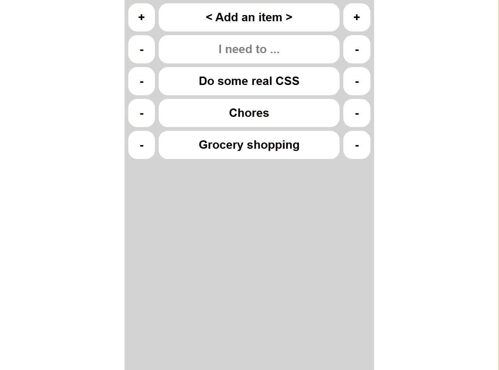

# web-to-do-list

A simple single file to-do list web app that persists data with localstorage.

---

Had a bit of a laugh at an article where a dev couldn't write a to-do app without relying on AI assistance.
I however had not done a to-do app before so figured I'd give it a whirl and compare my experience.

It was a short journey inconvenienced by my lack of css capabilities.
Most of the fancy css is just slightly modified StackOverflow suggestions, and I suppose with AI would come the convenience of not having to search the forum.
I did however come out with a stronger grasp on some CSS concepts that came with the use cases and problem descriptions that accompany the forum.

If you're looking for an interesting read, I entered the rabbit hole in [this article](https://nmn.gl/blog/ai-and-learning) by `Namanyay` which outlines my experience in the past with AI essentially trading off knowledge gain for the speed of quick fixes.